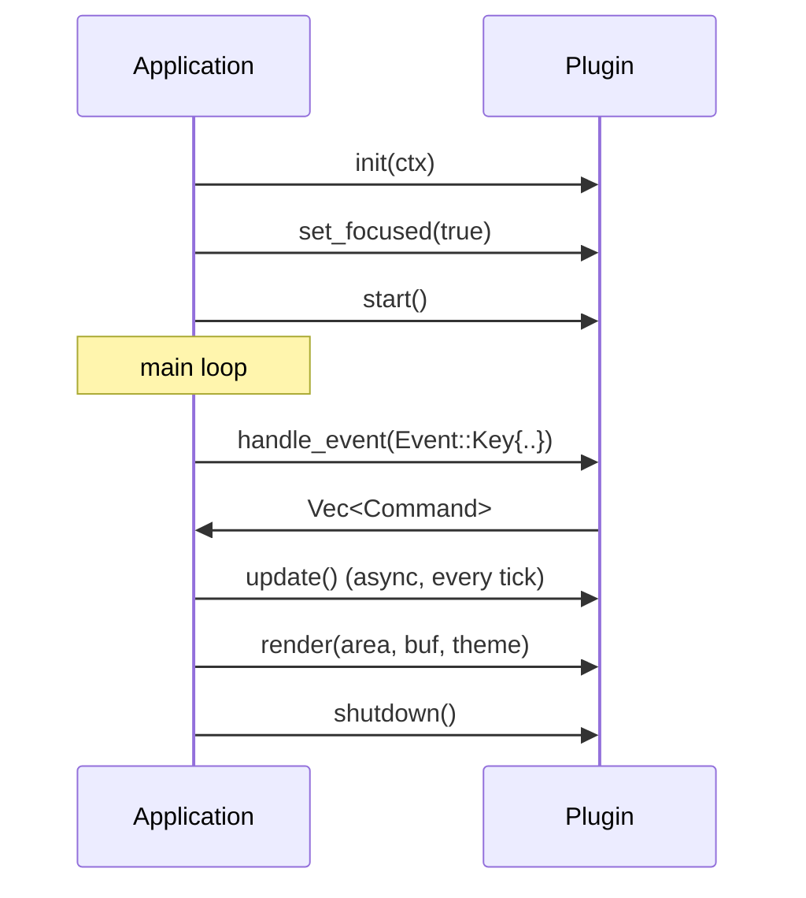
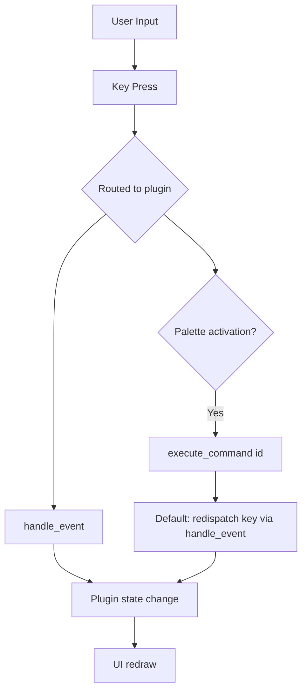

# RightClick Architecture

Complete architecture documentation for the RightClick TUI application. The code
sketches below mirror the current implementation in `src/`. When a type or
signature changes, update this file alongside the code.

## Table of Contents

- [Overview](#overview)
- [Design Philosophy](#design-philosophy)
- [Architecture](#architecture)
- [Plugin System](#plugin-system)
- [Event System](#event-system)
- [Keymap System](#keymap-system)
- [State Machine](#state-machine)
- [State Persistence](#state-persistence)
- [Creating Plugins](#creating-plugins)
- [Integration Points](#integration-points)

---

## Overview

**RightClick** is a terminal UI (TUI) application written in Rust that provides a vim-like interface for file operations, git management, and AI coding assistant integration. It is ported from the **sidecar** project (written in Go) and shares the same plugin-based architecture.

### Goals

1. **Modularity** - Plugin-based architecture allows features to be added without core changes
2. **User Experience** - Vim-like keybindings, lazygit-style navigation
3. **Performance** - Rust for performance, async operations for responsiveness
4. **Extensibility** - Easy to add new plugins and integrate with external tools

### Design Philosophy

The application follows the **Functional Core & Imperative Shell (FC&IS)** pattern:

- **Pure Core** - Business logic in `src/core/` is free of side effects
- **Imperative Shell** - `src/shell/` handles I/O, state, and orchestration

This separation enables:
- Easy testing of pure business logic
- Deterministic state transitions
- Clear boundaries between components

---

## Architecture

### Directory Structure

```
rightclick/
├── src/
│   ├── core/              # Pure functional core
│   │   ├── models/        # Domain models (theme, git, conversation, state machine)
│   │   ├── logic/         # Pure business logic functions
│   │   └── rules/         # Business rules and validation
│   ├── shell/             # Imperative shell (I/O, orchestration)
│   │   ├── usecases/      # Use-case orchestration
│   │   ├── repositories/  # Data access
│   │   ├── services/      # External integrations (git CLI)
│   │   ├── services_full/ # Full git service implementation (gix-backed)
│   │   ├── handlers/      # Entry points
│   │   └── machines/      # State machines for complex flows
│   ├── adapters/          # AI agent adapters (Claude, Cursor, Codex, ...)
│   ├── plugins/           # Built-in plugins (gitstatus, filebrowser, ...)
│   ├── plugin/            # Plugin trait, registry, context
│   ├── event/             # Event bus (pub/sub)
│   ├── state/             # State persistence
│   ├── keymap/            # Keyboard shortcuts
│   ├── search/            # Global/command search overlay
│   ├── settings/          # Settings modal
│   ├── modal/             # Modal system
│   ├── palette/           # Command palette entries
│   ├── theme/             # Theme resolution
│   ├── ui/                # Reusable TUI components
│   ├── tty/               # Terminal/tmux integration
│   ├── version/           # Version checking
│   └── main.rs            # Application entry point
└── Cargo.toml             # Dependencies
```

### Component Diagram

```mermaid
graph TB
    subgraph Core[\"Pure Core\"]
    subgraph Shell[\"Imperative Shell\"]
    subgraph Plugins[\"Plugin System\"]
    subgraph Events[\"Event Bus\"]
    subgraph State[\"State Persistence\"]

    Core --> Shell
    Shell --> Plugins
    Plugins --> Events
    Events --> Shell
    Plugins --> State
    Core --> State
```

---

## Plugin System

### Plugin Trait

The `Plugin` trait (`src/plugin/mod.rs`) defines the contract that all plugins
must implement. Required methods have no default; the rest ship with sensible
defaults.

```rust
#[async_trait]
pub trait Plugin: Send + Sync + std::fmt::Debug {
    // Identity
    fn id(&self) -> &str;
    fn name(&self) -> &str;
    fn icon(&self) -> char;

    // Lifecycle
    async fn init(&mut self, ctx: &PluginContext) -> anyhow::Result<()>;
    fn shutdown(&mut self) -> anyhow::Result<()>;

    // Event handling
    fn handle_event(&mut self, event: Event) -> Vec<Command>;

    // Rendering
    fn render(&self, area: Rect, buf: &mut Buffer, theme: &Theme);

    // Focus management
    fn is_focused(&self) -> bool;
    fn set_focused(&mut self, focused: bool);

    // Commands exposed to the palette and footer
    fn commands(&self) -> Vec<PluginCommand>;
    fn focus_context(&self) -> FocusContext;

    // ---- Optional methods with defaults ----

    // Compact status text for the global footer.
    fn status_line(&self) -> Option<String> { None }

    // Make global-search file results actionable for file-oriented plugins.
    fn reveal_path(&mut self, _path: &Path) -> bool { false }

    // Domain objects surfaced to the global search overlay.
    fn search_entries(&self) -> Vec<PluginSearchEntry> { Vec::new() }
    fn activate_search_result(&mut self, _entry_id: &str) -> bool { false }

    // Execute a palette command by id. The default implementation finds the
    // declared command and re-dispatches it through handle_event as a Key
    // event built from the command's shortcut character.
    fn execute_command(
        &mut self,
        command_id: &str,
    ) -> Result<PluginCommandExecution, PluginCommandError>;

    fn start(&mut self) -> Vec<Command> { vec![] }
    fn consumes_text_input(&self) -> bool { false }
    fn diagnostics(&self) -> Vec<Diagnostic> { vec![] }

    // Re-apply config after the user edits settings at runtime.
    fn apply_config(&mut self, _config: &Config) {}

    // Async tick driven by the main loop (load data, flush pending work).
    async fn update(&mut self) -> anyhow::Result<()> { Ok(()) }
}
```

### PluginCommand

`PluginCommand` is a plain data record that describes a palette/footer entry.
There is **no embedded handler closure** — activation is centralized in
`execute_command`, which re-dispatches the command's `key` through
`handle_event` so the same code path serves both keyboard shortcuts and palette
activation.

```rust
#[derive(Debug, Clone, PartialEq)]
pub struct PluginCommand {
    pub id: String,            // Unique within the plugin
    pub name: String,          // Display name
    pub description: String,   // Full description for the palette
    pub category: Category,    // Logical grouping
    pub key: char,             // Keyboard shortcut character
    pub context: FocusContext, // Where the command is available
    pub priority: u8,          // Footer display order (higher = earlier; 0 = default)
}
```

Constructors:

```rust
PluginCommand::new(id, name, description, category, key, context, priority)
PluginCommand::minimal(id, name, category, key)               // empty description, Global context, priority 0
PluginCommand::with_context(id, name, key, context)           // System category, priority 0
PluginCommand::with_context_description(id, name, description, key, context)
PluginCommand::with_priority(id, name, description, category, key, context, priority)
cmd.with_footer_priority(n)                                   // builder, sets priority
```

### Category Enum

Commands are grouped with `Category` (`src/plugin/mod.rs`), used by the palette:

```rust
#[derive(Debug, Clone, Copy, PartialEq, Eq, Hash)]
#[repr(usize)]
pub enum Category {
    Navigation = 0,
    Actions = 1,
    View = 2,
    Search = 3,
    Edit = 4,
    Git = 5,
    System = 6,
}
```

`Category::display_name()` returns the human-friendly label shown in the palette.

### Command (issued by plugins)

When handling events, plugins return `Command` values that the shell processes:

```rust
#[derive(Debug, Clone, PartialEq)]
pub struct Command {
    pub plugin_id: String,
    pub command_id: String,
    pub args: Option<String>,
}
```

### PluginSearchEntry

Domain objects a plugin contributes to the global search overlay:

```rust
#[derive(Debug, Clone, PartialEq, Eq)]
pub struct PluginSearchEntry {
    pub id: String,     // Stable id within the plugin
    pub title: String,  // Result title
    pub preview: String,// Result preview line
}
```

### PluginContext

Shared context provided to plugins during initialization (`src/plugin/context.rs`):

```rust
#[derive(Debug)]
pub struct PluginContext {
    pub work_dir: PathBuf,
    pub project_root: PathBuf,
    pub config_dir: PathBuf,
    pub config: Config,
    pub adapters: Arc<HashMap<String, Arc<dyn Adapter>>>,
    pub event_bus: Arc<Dispatcher>,
    pub logger: tracing::Span,
}
```

Helpers on `PluginContext`: `get_adapter(id)`, `has_adapter(id)`,
`set_adapters(map)`, `emit(event)` (publishes to `Topic::All`), and
`plugin_config(extractor)`.

### Plugin Registry

The `Registry` (`src/plugin/registry.rs`) manages plugin lifecycle:

- Registration with duplicate detection
- Initialization with error handling
- Graceful degradation (failed plugins marked unavailable)
- Shutdown with cleanup
- Configuration updates
- Query by ID

Note: `main.rs` currently drives a hand-rolled `Vec<Box<dyn Plugin>>` lifecycle
(re-init each plugin, focus the first one, call `update()` every tick) rather
than the registry; the registry remains available for host embeddings and tests.

---

## Event System

### Event

Events are defined in `src/event/types.rs`:

```rust
#[derive(Debug, Clone, PartialEq)]
pub enum Event {
    FileChanged { path: PathBuf },
    GitChanged,
    SessionFileChanged,
    TDUpdate,
    SessionUpdate,
    FocusChanged { plugin_id: String },
    RefreshNeeded,
    ConfigChanged,
    Error { message: String },
    Notification { message: String, level: NotificationEventLevel },
    Key { code: String, modifiers: KeyModifiers },
}
```

### Topics

Events are categorized by topic for selective subscription:

```rust
#[derive(Debug, Clone, Copy, PartialEq, Eq, Hash)]
pub enum Topic {
    FileChanges,
    GitChanges,
    AdapterWatch,
    ConfigChange,
    All, // Receives events regardless of their primary topic
}
```

`Topic::matches(source)` returns true for `All` or an exact match.

### Dispatcher

The event dispatcher (`src/event/dispatcher.rs`) provides:

- **Topic-based routing** - Events sent to specific topics only reach matching subscribers
- **Overflow strategies**:
  - `Drop` (default) - Silently drop new events when the buffer is full
  - `DropOldest` - Remove oldest events to make room for new ones
- **Configurable subscriptions** - Buffer size and overflow strategy per subscriber
- **Metrics tracking** - Atomic counters for published and dropped events

### Subscription

```rust
pub struct Subscription {
    pub id: u64,
    pub topic: Topic,
    pub receiver: Receiver<Event>,
    pub dispatcher: Option<DispatcherHandle>, // For cleanup
}
```

---

## Keymap System

There are two distinct action vocabularies. The UI-level `Action` is what
keyboard shortcuts resolve to; the state-machine-level `ActionId` is the
vocabulary used by guards and available-action computation.

### FocusContext

Focus contexts define where keyboard shortcuts are active
(`src/keymap/context.rs`):

```rust
#[derive(Debug, Clone, Copy, PartialEq, Eq, Hash)]
pub enum FocusContext {
    Global,
    GitStatus,
    GitDiff,
    FileBrowser,
    FileBrowserTree,
    Conversations,
    Workspace,
    WorkspaceInteractive,
    Modal,
    Palette,
    Search,
}
```

`FocusContext::is_root_context(ctx)` marks the top-level views where `q` quits
(Global, GitStatus, GitDiff, FileBrowser, FileBrowserTree, Conversations,
Workspace).

### Action (UI level)

`Action` (`src/keymap/bindings.rs`) is the outcome of resolving a key binding.
Plugins read these from `KeyBinding`/`KeyHandler` definitions, and the shell
maps them onto plugin behavior:

```rust
#[derive(Debug)]
pub enum Action {
    Quit, Refresh, SwitchPlugin(String), OpenPalette, OpenHelp,
    NavigateUp, NavigateDown, NavigateLeft, NavigateRight,
    NavigateFirst, NavigateLast,
    Select, Back, Open, Delete, Create, Edit, Copy, Paste,
    Search, Filter, Toggle, Expand, Collapse,
    Stage, Unstage, Commit, Push, Pull, Fetch,
    ContextMenu, NewFile, LinkTask, LaunchAgent, Enter, Merge,
    SwitchView, SwitchTab(usize),
    Confirm, Cancel,
    Custom(Box<dyn Any + Send + Sync>),
}
```

### ActionId (state-machine level)

`ActionId` (`src/core/models/action.rs`) is the smaller vocabulary the state
machine reasons about for guards and available actions:

```rust
pub enum ActionId {
    NavigateUp, NavigateDown, NavigateLeft, NavigateRight, Select, Back,
    Refresh, SwitchMode(ViewMode),
    Stage, Unstage, Diff, Commit, Push, Pull,
    Checkout, CreateBranch, DeleteBranch,
    StashSave, StashPop, StashDrop,
    Confirm, Cancel,
}
```

### Key Binding

```rust
pub struct Binding {
    pub key: String,            // Key combination (e.g., "ctrl+s", "g g")
    pub command_id: String,     // Command to execute
    pub context: FocusContext,   // Active context
}
```

---

## State Machine

### ViewState

States represent the current UI state (`src/core/models/state_machine.rs`):

```rust
#[derive(Clone, Debug, PartialEq, Default)]
pub enum ViewState {
    #[default]
    Initial,
    Ready,
    ItemSelected { index: usize },
    Editing { index: usize },
    Modal { parent: Box<ViewState> },
    Error { message: String, previous: Box<ViewState> },
}
```

### StateContext

Additional state that travels with `ViewState`:

```rust
#[derive(Clone, Debug, Default, PartialEq)]
pub struct StateContext {
    pub focus_pane: FocusPane,            // Which pane has focus
    pub view_mode: ViewMode,              // Current view mode
    pub item_count: usize,                // Items available for selection
    pub selected_index: Option<usize>,    // Selected item index (if any)
    pub available_actions: Vec<ActionId>, // Populated by the state machine
}
```

`StateContext` provides builders (`for_status`, `for_history`,
`with_focus_pane`, `with_view_mode`, `with_item_count`, `with_selected_index`).

### ViewMode and FocusPane (core)

```rust
pub enum ViewMode { Status, Diff, History, Branches, Stash } // default: Status
pub enum FocusPane { Sidebar, Main }                          // default: Sidebar
```

(Note: the `workspace` and `workers` plugins define their own local
`ViewMode`/`FocusPane` enums for plugin-specific view state; those are separate
from the core state-machine types.)

### StateMachine

```rust
#[derive(Clone, Debug)]
pub struct StateMachine {
    pub current: ViewState,
    pub context: StateContext,
}
```

`StateMachine::available_actions()` returns the `ActionId`s permitted in the
current state; `can_execute(action)` checks membership. The git-status plugin
additionally ships a `GitStateMachine` (`src/plugins/gitstatus/`) that wraps
this model with lazygit-style view transitions.

### Guards

Actions are validated against current state before execution
(`src/core/models/action.rs`):

```rust
#[derive(Clone, Debug, PartialEq)]
pub enum GuardError {
    NoSelection,
    InvalidSelection { reason: String },
    WrongViewMode { current: ViewMode, required: ViewMode },
    WrongFocus { current: FocusPane, required: FocusPane },
    InvalidState { current: ViewState, action: ActionId },
    Custom { message: String },
}
```

`GuardResult::Authorized | Denied(GuardError)` and
`ActionResult::Success | SuccessWithState(ViewState) | Denied(GuardError) |
Failed { error }` round out the guard/execution protocol.

---

## State Persistence

### State Structure

Persisted UI state lives in `src/state/types.rs` as `State` (not
`PersistentState`). It is serialized to JSON under the config directory:

```rust
#[derive(Debug, Clone, Serialize, Deserialize, PartialEq)]
pub struct State {
    pub version: u32,                                       // STATE_VERSION = 1
    pub git_diff_mode: DiffMode,                            // Unified | SideBySide
    pub workspace_diff_mode: DiffMode,
    pub git_graph_enabled: bool,
    pub line_wrap_enabled: bool,
    pub active_plugins: HashMap<String, String>,            // workdir -> plugin id
    pub file_browser: HashMap<String, FileBrowserState>,    // per workdir
    pub workspace: HashMap<String, WorkspaceState>,         // per workdir
    pub last_worktree: HashMap<String, String>,             // repo -> worktree path
}
```

### Project-Scoped State

```rust
#[derive(Debug, Clone, Serialize, Deserialize, PartialEq, Default)]
pub struct FileBrowserState {
    pub selected_file: Option<String>,
    pub expanded_dirs: Vec<String>,
    pub scroll_offset: usize,
}

#[derive(Debug, Clone, Serialize, Deserialize, PartialEq, Default)]
pub struct WorkspaceState {
    pub selected_workspace: Option<String>,
    pub view_mode: ViewMode, // state::types::ViewMode: List | Kanban
}
```

### Access Functions

```rust
// Save the whole state atomically (temp file + rename).
rightclick::state::persistence::save(&state)?;

// Load with automatic migration when version differs.
let state = rightclick::state::persistence::load()?;

// Per-project file-browser state.
rightclick::state::set_file_browser_state(workdir, fb_state);
```

The state file path resolves via `directories::ProjectDirs` to
`~/Library/Application Support/com.rightclick.rightclick/state.json` on macOS
(`com.rightclick.rightclick` qualifier).

---

## Creating Plugins

### Plugin Template

This template compiles against the current trait and command API:

```rust
use async_trait::async_trait;
use ratatui::{buffer::Buffer, layout::Rect};
use anyhow::Result;

use rightclick::core::models::Theme;
use rightclick::event::Event;
use rightclick::keymap::FocusContext;
use rightclick::plugin::{
    Category, Command, Plugin, PluginCommand, PluginContext,
};

#[derive(Debug)]
pub struct MyPlugin {
    focused: bool,
}

impl MyPlugin {
    pub fn new() -> Self {
        Self { focused: false }
    }
}

#[async_trait]
impl Plugin for MyPlugin {
    fn id(&self) -> &str { "my-plugin" }
    fn name(&self) -> &str { "My Plugin" }
    fn icon(&self) -> char { 'M' }

    async fn init(&mut self, _ctx: &PluginContext) -> Result<()> {
        // Initialize plugin state
        Ok(())
    }

    fn shutdown(&mut self) -> Result<()> {
        // Cleanup resources
        Ok(())
    }

    fn handle_event(&mut self, event: Event) -> Vec<Command> {
        // Handle events; return Commands for the shell to process
        let _ = event;
        Vec::new()
    }

    fn render(&self, area: Rect, buf: &mut Buffer, theme: &Theme) {
        // Draw plugin UI
        let _ = (area, buf, theme);
    }

    fn is_focused(&self) -> bool { self.focused }
    fn set_focused(&mut self, focused: bool) { self.focused = focused; }

    fn commands(&self) -> Vec<PluginCommand> {
        vec![
            PluginCommand::with_context_description(
                "refresh",
                "Refresh",
                "Reload my-plugin data",
                'r',
                FocusContext::Global,
            )
            .with_footer_priority(3),
            PluginCommand::new(
                "act",
                "Act",
                "Run the plugin's main action",
                Category::Actions,
                'a',
                FocusContext::Global,
                0,
            ),
        ]
    }

    fn focus_context(&self) -> FocusContext {
        FocusContext::Global
    }
}
```

Because `execute_command` has a working default implementation, declaring a
command in `commands()` is enough to make it activatable from the palette.

### Lifecycle Diagram



### Command Flow



---

## Integration Points

### Event Bus Communication

Plugins communicate via the event bus:

```rust
// Publish (Topic::All reaches every subscriber)
ctx.event_bus.publish(Topic::GitChanges, Event::GitChanged);

// In handle_event
fn handle_event(&mut self, event: Event) -> Vec<Command> {
    match event {
        Event::GitChanged => { /* refresh */ }
        Event::RefreshNeeded => { /* reload */ }
        _ => {}
    }
    Vec::new()
}
```

### State Persistence

Plugins can save/load per-project state:

```rust
use rightclick::state::{set_file_browser_state, FileBrowserState};

set_file_browser_state(
    &ctx.work_dir.to_string_lossy(),
    FileBrowserState {
        selected_file: Some("main.rs".to_string()),
        expanded_dirs: Vec::new(),
        scroll_offset: 5,
    },
);
```

### External Adapters

Plugins access external services (AI coding assistants) via adapters:

```rust
// Get an adapter by id
if let Some(adapter) = ctx.get_adapter("claude-code") {
    // Use adapter
}
```

The shipped adapters (Claude Code, Cursor, Codex, Gemini, Warp, Amp, Kiro,
OpenCode) are discovered with `create_default_registry()` and passed into
plugin context at startup.

---

## See Also

- [AGENTS.md](./AGENTS.md) - Development guidelines and FC&IS conventions
- [FC&IS Architecture](https://github.com/ntjb/core/blob/main/FUNCTIONAL_CORE_IMPERATIVE_SHELL.md) - Design pattern
- [ratatui](https://github.com/ratatui/ratatui) - TUI framework
- [sidecar](https://github.com/guyghost/sidecar) - Original Go implementation
