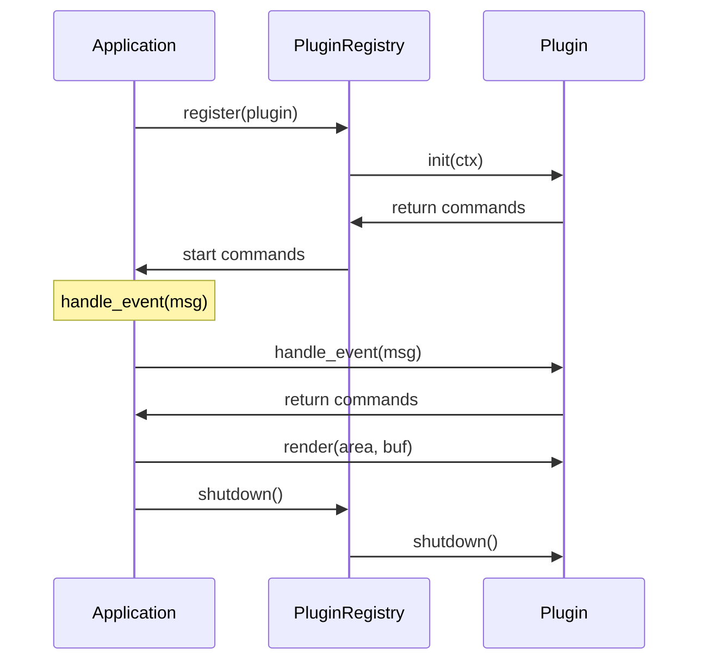

# RightClick Architecture

Complete architecture documentation for the RightClick TUI application.

## Table of Contents

- [Overview](#overview)
- [Design Philosophy](#design-philosophy)
- [Architecture](#architecture)
- [Plugin System](#plugin-system)
- [Event System](#event-system)
- [Keymap System](#keymap-system)
- [State Machine](#state-machine)
- [State Persistence](#state-persistence)
- [Creating Plugins](#creating-plugins)

---

## Overview

**RightClick** is a terminal UI (TUI) application written in Rust that provides a vim-like interface for file operations, git management, and AI coding assistant integration. It is ported from the **sidecar** project (written in Go) and shares the same plugin-based architecture.

### Goals

1. **Modularity** - Plugin-based architecture allows features to be added without core changes
2. **User Experience** - Vim-like keybindings, lazygit-style navigation
3. **Performance** - Rust for performance, async operations for responsiveness
4. **Extensibility** - Easy to add new plugins and integrate with external tools

### Design Philosophy

The application follows the **Functional Core & Imperative Shell (FC&IS)** pattern:

- **Pure Core** - Business logic in `src/core/` is free of side effects
- **Imperative Shell** - `src/shell/` handles I/O, state, and orchestration

This separation enables:
- Easy testing of pure business logic
- Deterministic state transitions
- Clear boundaries between components

---

## Architecture

### Directory Structure

```
rightclick/
├── src/
│   ├── core/              # Pure functional core
│   │   ├── models/     # Domain models (theme, git, conversation, etc.)
│   │   ├── logic/      # Pure business logic functions
│   ├── shell/             # Imperative shell (I/O, orchestration)
│   ├── plugin/            # Plugin system
│   ├── event/             # Event bus (pub/sub)
│   ├── state/             # State persistence
│   ├── keymap/           # Keyboard shortcuts
│   ├── ui/               # TUI rendering
│   └── main.rs           # Application entry point
└── Cargo.toml           # Dependencies
```

### Component Diagram

```mermaid
graph TB
    subgraph Core["Pure Core"]
    subgraph Shell["Imperative Shell"]
    subgraph Plugins["Plugin System"]
    subgraph Events["Event Bus"]
    subgraph State["State Persistence"]

    Core --> Shell
    Shell --> Plugins
    Plugins --> Events
    Events --> Shell
    Plugins --> State
    Core --> State
```

---

## Plugin System

### Plugin Trait

The `Plugin` trait (`src/plugin/mod.rs`) defines the contract that all plugins must implement.

```rust
#[async_trait]
pub trait Plugin: Send + Sync + std::fmt::Debug {
    // Identity
    fn id(&self) -> &str;
    fn name(&self) -> &str;
    fn icon(&self) -> char;

    // Lifecycle
    async fn init(&mut self, ctx: &PluginContext) -> anyhow::Result<()>;
    fn shutdown(&mut self) -> anyhow::Result<()>;

    // Event handling
    fn handle_event(&mut self, event: Event) -> Vec<Command>;

    // Rendering
    fn render(&self, area: Rect, buf: &mut Buffer, theme: &Theme);

    // Focus management
    fn is_focused(&self) -> bool;
    fn set_focused(&mut self, focused: bool);

    // Commands exposed to user
    fn commands(&self) -> Vec<PluginCommand>;
    fn focus_context(&self) -> FocusContext;

    // Async updates (optional, with default)
    async fn update(&mut self) -> anyhow::Result<()> { Ok(()) }
}
```

### PluginCommand Structure

Commands exposed by plugins include:

```rust
pub struct PluginCommand {
    pub id: String,           // Unique identifier
    pub name: String,          // Display name
    pub description: String,     // Full description for command palette
    pub category: CommandCategory,  // Logical grouping
    pub context: FocusContext,    // Where command is available
    pub handler: Box<dyn Fn() -> Action + Send + Sync>,  // Execution handler
    pub priority: u32,         // Display order (1=highest)
}
```

### CommandCategory Enum

```rust
pub enum CommandCategory {
    Navigation,  // Movement commands
    Actions,     // Item operations (stage, commit, delete)
    View,        // View toggles
    Search,      // Search and filter
    Edit,        // Text editing
    Git,         // Git operations
    System,      // App-level (quit, preferences)
}
```

### PluginContext

Shared context provided to plugins during initialization:

```rust
pub struct PluginContext {
    pub work_dir: PathBuf,              // Current working directory
    pub project_root: PathBuf,           // Git repository root
    pub config_dir: PathBuf,           // Configuration directory
    pub config: Config,                // Application configuration
    pub adapters: Arc<HashMap<String, Arc<dyn Adapter>>>,  // AI adapters
    pub event_bus: Arc<Dispatcher>,  // Event bus
    pub logger: tracing::Span,          // Logging
}
```

### Plugin Registry

The `Registry` (`src/plugin/registry.rs`) manages plugin lifecycle:

- Registration with duplicate detection
- Initialization with error handling
- Graceful degradation (failed plugins marked unavailable)
- Shutdown with cleanup
- Configuration updates
- Query by ID

---

## Event System

### Topics

Events are categorized by topic for selective subscription:

```rust
pub enum Topic {
    FileChanges,      // File system changes
    GitChanges,      // Git repository changes
    AdapterWatch,     // External process monitoring
    ConfigChange,      // Configuration changes
    All,             // Receives all events
}
```

### Dispatcher

The event dispatcher (`src/event/dispatcher_new.rs`) provides:

- **Topic-based routing** - Events sent to specific topics only reach matching subscribers
- **Overflow strategies**:
  - `Drop` - Silently drop new events when buffer is full
  - `DropOldest` - Remove oldest events to make room for new ones
- **Configurable subscriptions** - Buffer size and overflow strategy per subscriber
- **Metrics tracking** - Atomic counters for published and dropped events

### Subscription

```rust
pub struct Subscription {
    pub id: u64,                    // Unique subscriber ID
    pub topic: Topic,               // Subscribed topic
    pub receiver: Receiver<Event>,    // Event channel
    pub dispatcher: Option<DispatcherHandle>,  // For cleanup
}
```

---

## Keymap System

### FocusContext

Focus contexts define where keyboard shortcuts are active:

```rust
pub enum FocusContext {
    Global,           // Application-wide shortcuts
    GitStatus,       // Git status view
    GitDiff,         // Git diff view
    FileBrowser,      // File browser
    FileBrowserTree,  // File browser tree pane
    Conversations,    // AI conversations
    Workspace,        // Workspace management
    TDMonitor,        // TODO tracking
    Modal,           // Modal dialogs
    Palette,          // Command palette
    WorkspaceInteractive,  // Workspace input mode
}
```

### Key Binding

```rust
pub struct Binding {
    pub key: String,            // Key combination (e.g., "ctrl+s", "g g")
    pub command_id: String,     // Command to execute
    pub context: FocusContext,   // Active context
}
```

### Action Enum

```rust
pub enum Action {
    Quit, Refresh,
    NavigateUp, NavigateDown, NavigateLeft, NavigateRight,
    Select, Back, Open,
    Delete, Create, Edit,
    Stage, Unstage, Commit,
    Push, Pull, Fetch,
    Search, Filter,
    Toggle, Expand, Collapse,
    ContextMenu,
    SwitchPlugin(String),
    OpenPalette, OpenHelp,
    Custom(Box<dyn Any + Send + Sync>),
}
```

---

## State Machine

### ViewState

States represent the current UI state:

```rust
pub enum ViewState {
    Initial,                    // Application startup
    Ready,                      // Ready for user input
    ItemSelected { index: usize },    // Item selected
    Editing { index: usize },        // Editing item
    Modal { parent: Box<ViewState> }, // Modal open
    Error { message: String, previous: Box<ViewState> },
}
```

### StateContext

Additional state that travels with ViewState:

```rust
pub struct StateContext {
    pub focus_pane: FocusPane,      // Which pane has focus
    pub view_mode: ViewMode,           // Current view mode
    pub selection: SelectionState,       // Selection state
}
```

### Guards

Actions are validated against current state before execution:

```rust
pub enum GuardError {
    NoSelection,
    InvalidSelection { reason: String },
    WrongViewMode { current: ViewMode, required: ViewMode },
    WrongFocus { current: FocusPane, required: FocusPane },
    InvalidState { current: ViewState, action: ActionId },
    Custom { message: String },
}
```

---

## State Persistence

### PersistentState Structure

```rust
pub struct PersistentState {
    pub version: u32,                    // State file format version
    pub git_diff_mode: String,            // Git diff display mode
    pub workspace_diff_mode: String,        // Workspace diff mode
    pub git_graph_enabled: bool,           // Commit graph visibility
    pub line_wrap_enabled: bool,           // Line wrapping in text views
    pub active_plugins: HashMap<String, String>,      // Last active plugin per workdir
    pub file_browser: HashMap<String, FileBrowserState>,   // File browser state per project
    pub workspace: HashMap<String, WorkspaceState>,       // Workspace state per project
    pub last_worktree: HashMap<String, String>,        // Worktree tracking
}
```

### Project-Scoped State

```rust
// File browser state
pub struct FileBrowserState {
    pub selected_file: Option<String>,
    pub expanded_dirs: Vec<String>,
    pub scroll_offset: usize,
}

// Workspace state
pub struct WorkspaceState {
    pub selected_workspace: Option<String>,
    pub view_mode: ViewMode,
}
```

### Access Functions

```rust
// Thread-safe access
with_state(|state| { /* read only */ });

// Mutable access with auto-save
with_state_mut(|state| { /* modify and save */ });

// Project-specific state
let fb_state = get_file_browser_state("/path/to/project");
set_file_browser_state("/path/to/project", new_state);
```

---

## Creating Plugins

### Plugin Template

```rust
use async_trait::async_trait;
use crate::plugin::{Plugin, PluginCommand, PluginContext, CommandCategory};
use crate::core::models::Theme;
use crate::event::Event;
use crate::keymap::{Action, FocusContext};
use ratatui::{layout::Rect, buffer::Buffer};
use anyhow::Result;

pub struct MyPlugin {
    focused: bool,
    name: String,
}

#[async_trait]
impl Plugin for MyPlugin {
    fn id(&self) -> &str { "my-plugin" }
    fn name(&self) -> &str { &self.name }
    fn icon(&self) -> char { '' }

    async fn init(&mut self, _ctx: &PluginContext) -> Result<()> {
        // Initialize plugin state
        Ok(())
    }

    fn shutdown(&mut self) -> Result<()> {
        // Cleanup resources
        Ok(())
    }

    fn handle_event(&mut self, event: Event) -> Vec<Command> {
        // Handle events, return commands
        vec![]
    }

    fn render(&self, area: Rect, buf: &mut Buffer, theme: &Theme) {
        // Draw plugin UI
    }

    fn is_focused(&self) -> bool { self.focused }
    fn set_focused(&mut self, focused: bool) { self.focused = focused; }

    fn commands(&self) -> Vec<PluginCommand> {
        vec![
            PluginCommand::new(
                "my-action",
                "My Action",
                "Does something useful",
                CommandCategory::Actions,
                FocusContext::Global,
                || Action::Refresh,
            ),
        ]
    }

    fn focus_context(&self) -> FocusContext {
        FocusContext::Global
    }
}
```

### Lifecycle Diagram



### Command Flow

```mermaid
flowchart TD
    A[User Input] --> B[Key Press]
    B --> C{Keymap Lookup}
    C --> D{Match Binding?}
    D -->|E[Yes]
    E --> F[Execute Handler]
    F --> G[Return Action]
    G --> H{App Processes Action}
    H --> I[Plugin State Change]
    I --> J[UI Update]

    D -->|K[No]
    K --> L[Pass to Next Handler]
```

---

## Integration Points

### Event Bus Communication

Plugins communicate via the event bus:

```rust
// Subscribe to events
let mut sub = ctx.event_bus.subscribe(Topic::GitChanges);

// Publish events
ctx.event_bus.publish(Topic::GitChanges, Event::GitChanged);

// In plugin update
fn handle_event(&mut self, event: Event) -> Vec<Command> {
    match event {
        Event::GitChanged => vec![/* commands */],
        _ => vec![],
    }
}
```

### State Persistence

Plugins can save/load state:

```rust
// Save plugin state
use rightclick::state::{set_file_browser_state, FileBrowserState};

set_file_browser_state(
    &ctx.work_dir,
    FileBrowserState {
        selected_file: Some("main.rs".to_string()),
        scroll_offset: 5,
    },
);

// Load plugin state
let state = rightclick::state::get_file_browser_state(&ctx.work_dir);
```

### External Adapters

Plugins access external services (AI coding assistants) via adapters:

```rust
// Get an adapter
if let Some(adapter) = ctx.adapters.get("claude-code") {
    // Use adapter
}
```

---

## See Also

- [FC&IS Architecture](https://github.com/ntjb/core/blob/main/FUNCTIONAL_CORE_IMPERATIVE_SHELL.md) - Design pattern
- [ratatui](https://github.com/ratatui/ratatui) - TUI framework
- [sidecar](https://github.com/guyghost/sidecar) - Original Go implementation
